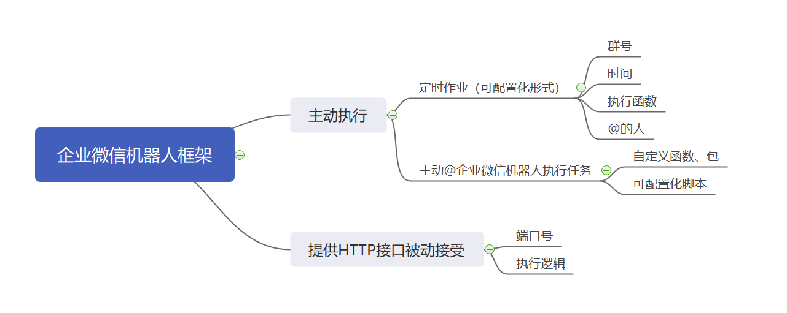

####企业微信机器人框架设计:

企业微信机器人框架主要分为主动执行模块和提供HTTP接口被动接受模块。

1. 定时作业（可配置化形式）:

a. 群号（难点）：

	因为group_id对想配置得人来说难以获取,目前已知获取方式是向机器人发送消息,截取其中的group_id.

	解决策略:第一次添加机器人时指定某个字段@机器人,机器人自动截取该群id加入group_id_list,从此该作业定时执行时都会对该群进行操作。

b. 时间:

	使用和python的APScheduler同样的配置模式，采用 任务id、函数名字和定时模式三个字段来配置发送的时间、任务。

c. 执行函数:

	由用户自定义提供请求API的函数,返回文本str后传入框架给出的接口函数，即执行完成

d. @的人:
	
	由用户传入list给框架的接口函数,list的为空默认不传入,list中有[@all]则@所有成员

	后端实现：只需要填写企业微信机器人接口中的mention_list即可

2. 主动@微信机器人执行任务

a.自定义函数、包

	将所要执行的函数打包上传到指定目录（之后作者来指定），并指明:任务名、匹配词/词组列表、优先级等。

	可以采用修饰器的方式实现本例

b.脚本文件

	同上述内容相同，将脚本文件传入指定目录下，并配置好三个需求。	
	可采用配置文件的形式实现

3. 提供HTTP接口API

	只需要指定端口和处理内容函数,处理完的内容同样可以通过定时部分所提到的发送消息接口API，向群内推送